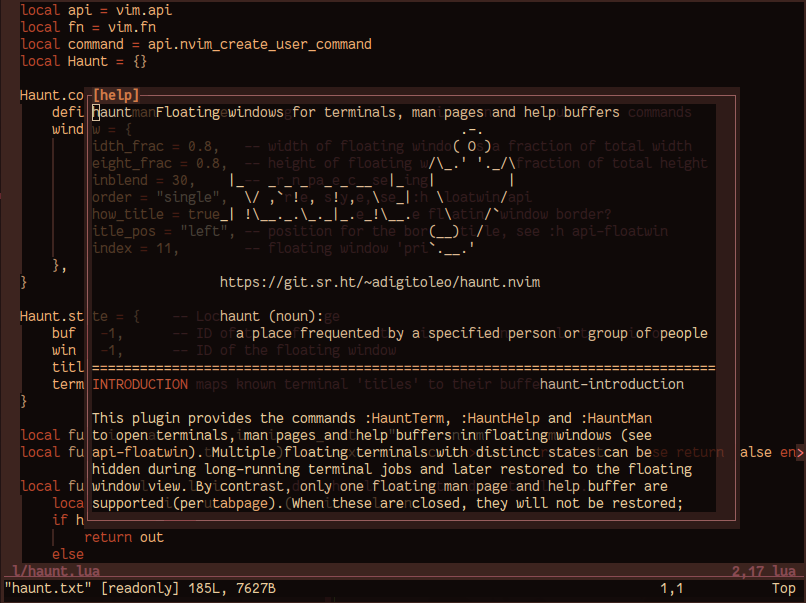

# haunt.nvim

Floating windows for terminals, man pages and help buffers.

> **haunt** (noun):
>   *a place frequented by a specified person or group of people*

This [NeoVim](https://neovim.io) plugin, written in Lua, offers alternative
commands to open embedded terminals, man pages and help buffers in floating
windows. Existing terminal buffers can also be opened in the floating window.
Commands like `:bnext`, `:bprevious`, `:b#` etc. are suppressed in this window.

Install the plugin using your preferred plugin manager. Alternatively, NeoVim
can load packages if they are added to your 'packpath'.

Available commands and options are described in `:help overview`.

Please send patches/queries to my [public inbox](https://lists.sr.ht/~adigitoleo/public-inbox).

### Examples

Open the documentation for this plugin in a floating window:

    :HauntHelp haunt

Open a floating terminal called "scratch", run command, close it, and restore:

    :HauntTerm -t scratch
    :startinsert
    echo "scratch"<Cr>
    <C-\><C-n>
    :quit
    :HauntTerm -t scratch

Switch between two different interactive Python sessions:

    :HauntTerm -t py1 python
    :startinsert
    print("py1")<Cr>
    <C-\><C-n>
    :HauntTerm -t py2 python
    :startinsert
    print("py2")<Cr>
    <C-\><C-n>
    :HauntTerm -t py1

Open the man page for `mandoc(1)` in a floating window:

    :HauntMan mandoc
